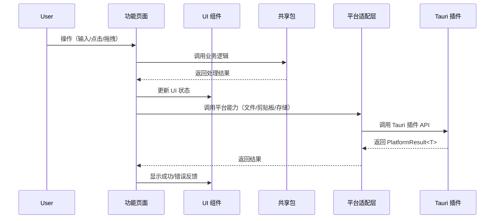
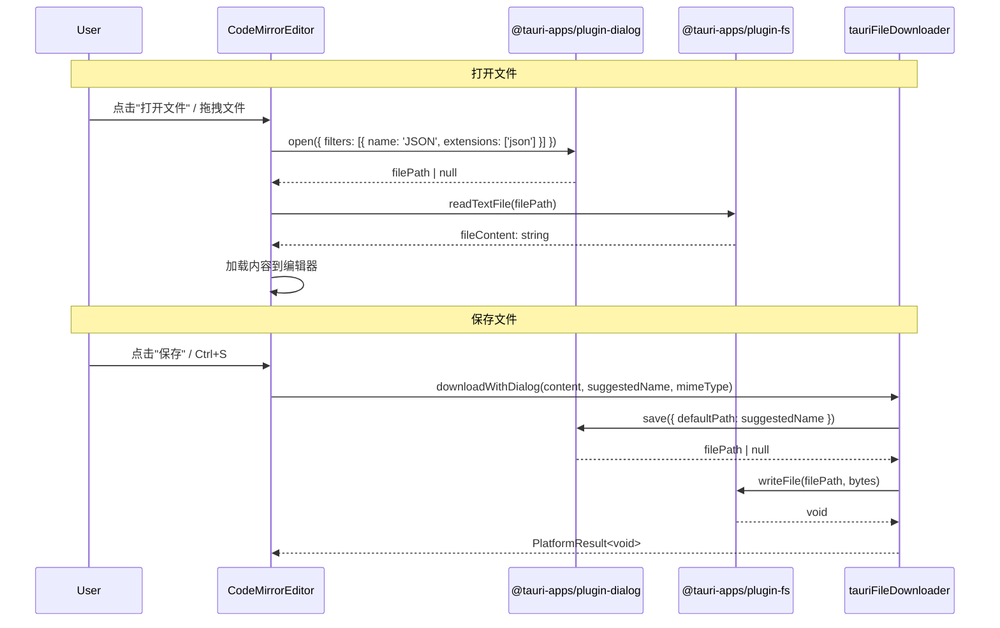
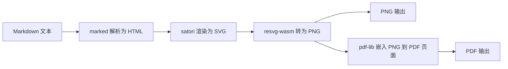

# Design Document

## Overview

本设计文档描述桌面端应用（Tauri 2.x + React 18 + Vite）三个核心功能页面的完整实现方案。当前三个页面仅为 placeholder 级别，本设计将其升级为生产可用的完整功能，充分利用桌面端特性：原生文件系统访问、大窗口分栏布局、系统剪贴板深度集成、无跨域限制的 HTTP 访问、本地持久化存储。

### 设计目标

- 三个功能页面（JSON Formatter、QR Code Generator、Web Export）达到生产可用水平
- 充分利用已有的 `@quick-tools/platform` 适配层和共享包
- 利用桌面端大窗口空间实现分栏布局和实时预览
- 支持批量操作（批量二维码生成、批量 URL 导出）
- 集成 Turndown 实现 HTML → Markdown 的结构化转换
- 使用 satori + resvg-wasm 实现 PDF/PNG 渲染

### 非目标

- 不修改共享包（`@quick-tools/json-formatter`、`@quick-tools/qr-code-gen`、`@quick-tools/web-export`）的核心逻辑
- 不修改 `@quick-tools/platform` 接口定义
- 不涉及浏览器扩展端的改动

## Architecture

```mermaid
graph TB
    subgraph "apps/desktop/src/pages"
        JFP["JsonFormatterPage"]
        QRP["QrCodeGenPage"]
        WEP["WebExportPage"]
    end

    subgraph "apps/desktop/src/components"
        CM["CodeMirrorEditor"]
        DIFF["DiffViewer"]
        QRR["QrRenderer"]
        BATCH_QR["BatchQrPanel"]
        PREVIEW["MarkdownPreview"]
        BATCH_URL["BatchUrlPanel"]
        HIST["HistoryPanel"]
        RESIZE["ResizableSplitPane"]
    end

    subgraph "apps/desktop/src/platform"
        FD["tauriFileDownloader"]
        CB["tauriClipboardAccess"]
        ST["tauriStorageAdapter"]
        HTTP["tauriHttpClient"]
        CE["tauriContentExtractor"]
    end

    subgraph "packages/ (shared)"
        JF["@quick-tools/json-formatter"]
        QR["@quick-tools/qr-code-gen"]
        WE["@quick-tools/web-export"]
        PL["@quick-tools/platform"]
    end

    JFP --> CM
    JFP --> DIFF
    JFP --> RESIZE
    JFP --> JF

    QRP --> QRR
    QRP --> BATCH_QR
    QRP --> HIST
    QRP --> QR

    WEP --> PREVIEW
    WEP --> BATCH_URL
    WEP --> HIST
    WEP --> RESIZE
    WEP --> WE

    CM --> PL
    QRR --> PL
    PREVIEW --> PL
    BATCH_QR --> PL
    BATCH_URL --> PL

    FD --> PL
    CB --> PL
    ST --> PL
    HTTP --> PL
    CE --> PL
```



### 数据流概览



### 文件操作数据流（打开/保存/拖拽）



### 目录结构（新增/修改文件）

```
apps/desktop/src/
├── pages/
│   ├── JsonFormatterPage.tsx      # 重写：分栏布局 + CodeMirror
│   ├── QrCodeGenPage.tsx          # 重写：完整二维码功能
│   └── WebExportPage.tsx          # 重写：预览 + 导出 + 批量
├── components/
│   ├── CodeMirrorEditor.tsx       # 新增：CodeMirror 6 封装
│   ├── DiffViewer.tsx             # 新增：JSON Diff 对比
│   ├── ResizableSplitPane.tsx     # 新增：可拖拽分栏
│   ├── QrRenderer.tsx             # 新增：二维码渲染 + 导出
│   ├── BatchQrPanel.tsx           # 新增：批量二维码
│   ├── MarkdownPreview.tsx        # 新增：Markdown 渲染预览
│   ├── BatchUrlPanel.tsx          # 新增：批量 URL 导出
│   ├── HistoryPanel.tsx           # 新增：通用历史记录侧边栏
│   └── Toast.tsx                  # 新增：轻量提示组件
├── hooks/
│   ├── useDebounce.ts             # 新增：防抖 hook
│   ├── useToast.ts                # 新增：Toast 状态管理
│   └── useHistory.ts             # 新增：历史记录 CRUD hook
├── lib/
│   ├── turndown-config.ts         # 新增：Turndown 配置和规则
│   ├── json-linter.ts             # 新增：JSON 语法检查（CodeMirror lint）
│   ├── qr-capacity.ts             # 新增：二维码容量计算
│   ├── batch-parser.ts            # 新增：批量内容解析
│   └── pdf-png-renderer.ts        # 新增：PDF/PNG 渲染管线
└── platform/
    ├── content-extractor.ts       # 修改：集成 Turndown
    └── file-opener.ts             # 新增：文件打开（读取）能力
```

## Components and Interfaces

### 1. JSON Formatter 页面

#### CodeMirrorEditor 组件

```typescript
// components/CodeMirrorEditor.tsx
interface CodeMirrorEditorProps {
  value: string
  onChange?: (value: string) => void
  readOnly?: boolean
  language?: "json" | "markdown"
  theme?: "light" | "dark"
  diagnostics?: Diagnostic[]
  placeholder?: string
}
```

**CodeMirror 6 扩展配置：**

- `@codemirror/lang-json` — JSON 语法高亮
- `@codemirror/language` — foldGutter（代码折叠）
- `@codemirror/view` — lineNumbers, highlightActiveLine
- `@codemirror/search` — 搜索替换（Ctrl+F / Cmd+F）
- `@codemirror/autocomplete` — bracketMatching
- `@codemirror/lint` — linter 集成（显示错误标记）
- `@codemirror/theme-one-dark` — 暗色主题

**实时格式化策略：**

- 左侧编辑器 `onChange` 触发 300ms debounce
- debounce 结束后调用 `parseJsonOrJsObject` + `formatJson`
- 解析失败时通过 `@codemirror/lint` 在错误位置显示红色下划线

#### DiffViewer 组件

```typescript
// components/DiffViewer.tsx
interface DiffViewerProps {
  left: string
  right: string
}
```

**Diff 实现方案：** 使用 CodeMirror 6 的 `@codemirror/merge` 扩展，提供 unified diff 视图。该扩展原生支持行级差异高亮（新增绿色、删除红色、修改黄色），无需额外 diff 算法库。

#### JsonFormatterPage 布局

```typescript
// pages/JsonFormatterPage.tsx 状态设计
type EditorMode = "format" | "diff"

interface JsonFormatterState {
  mode: EditorMode
  input: string
  output: string
  error: string | null
  // Diff 模式
  diffLeft: string
  diffRight: string
}
```

**页面结构：**

- 顶部工具栏：格式化 | 压缩 | Diff 对比 | 打开文件 | 保存文件 | 复制结果 | 从剪贴板粘贴
- 主体区域：`ResizableSplitPane` 包裹左右两个 `CodeMirrorEditor`
- 底部状态栏：错误信息 / 文件路径 / 字符数统计

#### 文件系统集成

```typescript
// platform/file-opener.ts
import { open } from "@tauri-apps/plugin-dialog"
import { readTextFile } from "@tauri-apps/plugin-fs"

export async function openJsonFile(): Promise<PlatformResult<string>> {
  const filePath = await open({
    filters: [{ name: "JSON", extensions: ["json"] }],
    multiple: false
  })
  if (!filePath) return createErrorResult("cancelled", "用户取消了文件选择")
  const content = await readTextFile(filePath as string)
  return createSuccess(content)
}
```

**拖拽支持：** 监听 CodeMirror 编辑器容器的 `drop` 事件，通过 `@tauri-apps/plugin-fs` 的 `readTextFile` 读取拖入文件内容。

### 2. QR Code Generator 页面

#### QrRenderer 组件

```typescript
// components/QrRenderer.tsx
interface QrRendererProps {
  content: string
  size: 128 | 256 | 512
  level: "L" | "M" | "Q" | "H"
  onExportPng: () => void
  onExportSvg: () => void
  onCopyToClipboard: () => void
}
```

**渲染方案：** 使用 `qrcode.react` 的 `QRCodeSVG` 组件进行实时渲染。导出 PNG 时，将 SVG 转为 Canvas 再导出 Uint8Array。

#### 容量计算模块

```typescript
// lib/qr-capacity.ts
interface QrCapacityInfo {
  charCount: number
  maxCapacity: number
  percentage: number
  isOverCapacity: boolean
}

export function calculateQrCapacity(
  content: string,
  level: "L" | "M" | "Q" | "H"
): QrCapacityInfo

export function validateQrContent(
  content: string,
  level: "L" | "M" | "Q" | "H"
): { valid: boolean; error?: string }
```

**容量限制参考（Version 40, Byte mode）：**

| 纠错等级 | 最大字节数 |
| -------- | ---------- |
| L        | 2953       |
| M        | 2331       |
| Q        | 1663       |
| H        | 1273       |

#### BatchQrPanel 组件

```typescript
// components/BatchQrPanel.tsx
interface BatchQrPanelProps {
  onBatchGenerate: (items: BatchQrItem[]) => void
  onBatchExport: (items: BatchQrItem[]) => void
}

interface BatchQrItem {
  line: number
  content: string
  valid: boolean
  error?: string
}
```

**批量导出流程：**

1. 用户输入多行文本，每行一条内容
2. 调用 `parseBatchContent` 解析并验证每行
3. 有效行生成二维码预览（网格展示）
4. 用户点击"批量导出"→ 弹出文件夹选择对话框
5. 逐个生成 PNG 并写入选定目录，文件名为 `qr-{index}-{content前20字符}.png`
6. 显示进度条（已完成数/总数）

```typescript
// lib/batch-parser.ts
export interface BatchLineResult {
  line: number
  content: string
  valid: boolean
  error?: string
}

export function parseBatchContent(
  text: string,
  level: "L" | "M" | "Q" | "H"
): BatchLineResult[]

export function parseBatchUrls(text: string): BatchLineResult[]
```

#### 历史记录集成

```typescript
// hooks/useHistory.ts
interface UseHistoryOptions<T> {
  storageKey: string
  maxItems?: number
}

interface UseHistoryReturn<T> {
  items: T[]
  add: (item: T) => Promise<void>
  remove: (index: number) => Promise<void>
  search: (query: string) => T[]
  clear: () => Promise<void>
}

export function useHistory<T extends { content: string; timestamp: number }>(
  options: UseHistoryOptions<T>
): UseHistoryReturn<T>
```

**搜索过滤逻辑：**

```typescript
// lib/history-filter.ts
export function filterHistory<T extends { content: string }>(
  items: T[],
  query: string
): T[] {
  if (!query.trim()) return items
  const lower = query.toLowerCase()
  return items.filter((item) => item.content.toLowerCase().includes(lower))
}
```

### 3. Web Export 页面

#### Turndown 集成（Content Extractor 改造）

```typescript
// lib/turndown-config.ts
import TurndownService from "turndown"
import { gfm } from "turndown-plugin-gfm"

export function createTurndownService(): TurndownService {
  const service = new TurndownService({
    headingStyle: "atx",           // # 风格标题
    codeBlockStyle: "fenced",      // ``` 围栏代码块
    bulletListMarker: "-",         // 无序列表使用 -
    emDelimiter: "*",
    strongDelimiter: "**"
  })
  service.use(gfm)  // 支持表格、删除线、任务列表
  return service
}
```

**Content Extractor 改造：**

当前 `tauriContentExtractor.extractFromUrl` 使用 Readability 提取后直接返回 `article.textContent` 作为 markdown 字段。改造后：

1. Readability 提取得到 `article.content`（HTML 字符串）
2. 将 HTML 传入 Turndown 转换为结构化 Markdown
3. 返回的 `ExtractedContent.markdown` 为 Turndown 输出
4. `ExtractedContent.plainText` 保持为 `article.textContent`

```typescript
// platform/content-extractor.ts 改造后的关键逻辑
const article = reader.parse()
const turndown = createTurndownService()
const markdown = turndown.turndown(article.content)  // HTML → Markdown

return createSuccess({
  title: article.title || doc.title || url,
  url,
  byline: article.byline || undefined,
  excerpt: article.excerpt || undefined,
  capturedAt: new Date().toISOString(),
  markdown,                    // 结构化 Markdown（来自 Turndown）
  plainText: article.textContent || ""
})
```

#### PDF/PNG 渲染策略

**技术选型：satori + resvg-wasm + pdf-lib**

该方案已在浏览器扩展端验证可行，桌面端复用相同技术栈：



**渲染管线设计：**

```typescript
// lib/pdf-png-renderer.ts
interface RenderOptions {
  width: number          // 默认 800px
  pageSize?: "A4"       // PDF 专用
  fonts: {
    body: ArrayBuffer
    mono: ArrayBuffer
  }
}

export async function renderToPng(
  markdown: string,
  source: MarkdownExportSource,
  options: RenderOptions
): Promise<Uint8Array>

export async function renderToPdf(
  markdown: string,
  source: MarkdownExportSource,
  options: RenderOptions
): Promise<Uint8Array>
```

**PDF 渲染流程：**

1. `marked` 将 Markdown 解析为 HTML
2. 按 A4 页面高度（约 1123px @96dpi）分页
3. 每页通过 `satori` 渲染为 SVG（传入字体 ArrayBuffer）
4. `resvg-wasm` 将 SVG 转为 PNG bytes
5. `pdf-lib` 创建 PDF 文档，每页嵌入对应 PNG 图像
6. 首页额外渲染标题、来源 URL、抓取时间的 header 区域

**PNG 渲染流程：**

1. `marked` 将 Markdown 解析为 HTML
2. 整体通过 `satori` 渲染为单张 SVG（宽度 800px，高度自适应）
3. 顶部包含标题和来源信息 header
4. `resvg-wasm` 将 SVG 转为 PNG bytes

**字体加载：** 复用扩展端已有的字体资源加载逻辑（`render-assets.ts` 模式），在桌面端从 bundled assets 加载。

#### MarkdownPreview 组件

```typescript
// components/MarkdownPreview.tsx
interface MarkdownPreviewProps {
  source: MarkdownExportSource | null
  mode: "rendered" | "source"
  onModeChange: (mode: "rendered" | "source") => void
}
```

**预览模式：**

- `rendered`：使用 `marked` 将 Markdown 渲染为 HTML，通过 `dangerouslySetInnerHTML` 显示（内容来自 Readability 已清洗，安全可控）
- `source`：使用 `CodeMirrorEditor`（readOnly + markdown 语法高亮）显示原始 Markdown

#### BatchUrlPanel 组件

```typescript
// components/BatchUrlPanel.tsx
interface BatchUrlPanelProps {
  onBatchExport: (urls: string[], format: ExportFormat) => void
}

interface BatchExportProgress {
  total: number
  completed: number
  currentUrl: string
  results: BatchExportResult[]
}

interface BatchExportResult {
  url: string
  success: boolean
  title?: string
  error?: string
}
```

**批量导出流程：**

1. 用户输入多行 URL
2. 调用 `parseBatchUrls` 解析有效 URL
3. 用户选择导出格式（Markdown / PDF / PNG）
4. 弹出文件夹选择对话框
5. 依次处理每个 URL：提取内容 → 渲染 → 保存文件
6. 单个 URL 失败不中断整体流程，记录错误
7. 完成后显示结果摘要

#### WebExportPage 布局

```typescript
// pages/WebExportPage.tsx 状态设计
interface WebExportState {
  mode: "single" | "batch"
  url: string
  loading: boolean
  source: MarkdownExportSource | null
  previewMode: "rendered" | "source"
  batchProgress: BatchExportProgress | null
  exportHistory: ExportHistoryItem[]
}

interface ExportHistoryItem {
  url: string
  title: string
  format: ExportFormat
  timestamp: number
}
```

### 4. 通用组件

#### ResizableSplitPane

```typescript
// components/ResizableSplitPane.tsx
interface ResizableSplitPaneProps {
  left: React.ReactNode
  right: React.ReactNode
  defaultRatio?: number    // 默认 0.5
  minRatio?: number        // 默认 0.2
  maxRatio?: number        // 默认 0.8
  direction?: "horizontal" | "vertical"
}
```

通过 CSS `flex-basis` + `pointer` 事件实现拖拽调整，无需额外依赖。

#### Toast 组件

```typescript
// components/Toast.tsx
interface ToastProps {
  message: string
  type: "success" | "error" | "info"
  duration?: number  // 默认 2000ms
  onClose: () => void
}
```

#### HistoryPanel 组件

```typescript
// components/HistoryPanel.tsx
interface HistoryPanelProps<T> {
  items: T[]
  searchQuery: string
  onSearchChange: (query: string) => void
  onSelect: (item: T) => void
  onDelete: (index: number) => void
  renderItem: (item: T) => React.ReactNode
  title: string
}
```

## Data Models

### JSON Formatter 状态

```typescript
interface JsonFormatterState {
  mode: "format" | "diff"
  input: string
  output: string
  error: { message: string; from: number; to: number } | null
  currentFilePath: string | null
}
```

### QR Code Generator 状态

```typescript
interface QrCodeGenState {
  // 单个模式
  content: string
  size: 128 | 256 | 512
  level: "L" | "M" | "Q" | "H"
  capacityInfo: QrCapacityInfo | null
  // 批量模式
  batchMode: boolean
  batchText: string
  batchItems: BatchLineResult[]
  batchExportProgress: { completed: number; total: number } | null
  // 历史
  history: HistoryItem[]
  searchQuery: string
}
```

### Web Export 状态

```typescript
interface WebExportState {
  mode: "single" | "batch"
  url: string
  loading: boolean
  source: MarkdownExportSource | null
  previewMode: "rendered" | "source"
  batchProgress: BatchExportProgress | null
  exportHistory: ExportHistoryItem[]
  historySearchQuery: string
}
```

### 存储 Key 设计

| 存储 Key | 数据类型 | 说明 |
| -------- | -------- | ---- |
| `qr-history` | `HistoryItem[]` | 二维码生成历史 |
| `web-export-history` | `ExportHistoryItem[]` | 网页导出历史 |

### 状态管理方案

采用 **React useState + 自定义 hooks** 的轻量方案，不引入额外状态管理库：

- 每个页面组件内部使用 `useState` 管理 UI 状态
- 持久化状态通过 `useHistory` hook 封装，内部调用 `StorageAdapter`
- 跨组件通信通过 props 传递（页面组件作为状态容器）
- 无需全局状态（三个页面完全独立，不共享数据）

**设计决策理由：** 三个功能页面互相独立，无共享状态需求。React 内置的 useState 配合自定义 hooks 已足够，引入 Redux/Zustand 等库会增加不必要的复杂度。

## Correctness Properties

*正确性属性是一种在系统所有有效执行中都应成立的特征或行为——本质上是对系统应做什么的形式化陈述。属性是人类可读规范与机器可验证正确性保证之间的桥梁。*

### Property 1: JSON 语法检查诊断位置有效性

*For any* 包含语法错误的 JSON 字符串，JSON linter 函数应产生至少一个诊断结果，且诊断的 `from` 和 `to` 位置应满足 `0 <= from <= to <= input.length`。

**Validates: Requirements 2.3**

### Property 2: JSON Diff 正确性

*For any* 两段 JSON 字符串 A 和 B，如果 A === B，则 diff 结果应为空（无差异）；如果 A !== B，则 diff 结果应包含至少一个变更条目。

**Validates: Requirements 3.2**

### Property 3: 二维码容量计算与验证

*For any* 字符串 content 和纠错等级 level，`calculateQrCapacity(content, level)` 返回的 `percentage` 应等于 `charCount / maxCapacity * 100`（浮点误差 ≤ 0.01），且 `isOverCapacity` 应等于 `percentage > 100`。此外，对于任意两个字符串 s1 和 s2，若 `s1.length < s2.length`，则 `calculateQrCapacity(s1, level).percentage <= calculateQrCapacity(s2, level).percentage`（单调性）。

**Validates: Requirements 6.4, 6.5**

### Property 4: 批量内容解析与验证

*For any* 多行文本字符串和纠错等级，`parseBatchContent(text, level)` 返回的结果应满足：(a) 结果数量等于输入中非空行（trim 后非空）的数量，(b) 每个结果的 `content` 等于对应行 trim 后的值，(c) `valid` 为 true 当且仅当该行内容未超过对应纠错等级的容量限制，(d) 结果顺序与输入行顺序一致。

**Validates: Requirements 8.2, 8.5**

### Property 5: 历史记录搜索过滤正确性

*For any* 历史记录列表和搜索关键词 query，`filterHistory(items, query)` 返回的结果应满足：(a) 所有返回项的 `content` 字段包含 query（大小写不敏感），(b) 所有未返回项的 `content` 字段不包含 query（大小写不敏感），(c) 返回项的相对顺序与原列表一致。

**Validates: Requirements 9.3**

### Property 6: Turndown HTML 元素保留

*For any* 包含标题（h1-h6）、链接（a）、图片（img）、代码块（pre/code）、列表（ul/ol）的有效 HTML 片段，经 Turndown 转换后的 Markdown 应满足：(a) h{N} 标签转为以 N 个 `#` 开头的行，(b) `<a href="url">text</a>` 转为包含 `[text](url)` 的文本，(c) `` 转为包含 `` 的文本，(d) `<pre><code>content</code></pre>` 转为包含 ` ``` ` 围栏的代码块，(e) `<ul><li>item</li></ul>` 转为包含 `- item` 的列表。

**Validates: Requirements 10.2, 10.3, 10.4, 10.5, 10.6**

### Property 7: Turndown 转换 round-trip 语义等价性

*For any* 由标题、段落、链接、列表、代码块组成的有效 HTML 文档，经 Turndown 转换为 Markdown 后，再经 `marked` 解析回 HTML，所得 HTML 的语义结构（标题层级数量、链接 href 集合、列表项数量）应与原始 HTML 一致。

**Validates: Requirements 10.7**

### Property 8: 批量 URL 处理容错性

*For any* 包含 N 个有效 URL 的批量输入（其中 M 个 URL 提取会失败），批量处理完成后的结果应满足：(a) `results.length === N`，(b) 成功数 + 失败数 === N，(c) 失败的结果包含非空 error 字段，(d) 所有 URL 都被处理（不因单个失败而中断）。

**Validates: Requirements 14.2, 14.4**

## Error Handling

### 错误处理策略

所有平台操作继续使用 `PlatformResult<T>` 模式，页面组件统一处理错误显示：

```typescript
// 通用错误处理模式
async function handlePlatformAction<T>(
  action: () => Promise<PlatformResult<T>>,
  onSuccess: (value: T) => void,
  onError: (error: PlatformError) => void
) {
  const result = await action()
  if (result.ok) {
    onSuccess(result.value)
  } else {
    if (result.error.category !== "cancelled") {
      onError(result.error)
    }
  }
}
```

### 错误分类与用户提示

| 场景 | 错误类别 | 用户提示（中文） |
| ---- | -------- | ---------------- |
| JSON 解析失败 | unknown | 无法解析为 JSON 或 JS 对象: {detail} |
| 文件读取失败 | unknown | 读取文件失败: {detail} |
| 文件保存取消 | cancelled | （静默，不显示错误） |
| 剪贴板写入失败 | permission | 剪贴板写入失败，请检查权限 |
| 二维码内容超限 | unknown | 内容过长，超出二维码容量限制（当前 {n} 字节，最大 {max} 字节） |
| URL 提取超时 | timeout | 请求超时，请检查网络连接后重试 |
| URL 提取失败 | network | 页面内容提取失败: {detail} |
| PDF/PNG 渲染失败 | unknown | 渲染失败: {detail} |
| 批量导出部分失败 | — | 导出完成：成功 {n} 个，失败 {m} 个 |

### 错误恢复策略

- **文件操作失败：** 保持编辑器当前状态不变，用户可重试
- **批量操作部分失败：** 继续处理剩余项，最终汇总展示
- **渲染失败：** 提供降级选项（如 PDF 失败时建议导出 Markdown）
- **存储失败：** 内存中保持数据，下次操作时重试持久化

## Testing Strategy

### 属性测试（Property-Based Testing）

使用 `fast-check` 库，配合 `vitest` 运行。每个属性测试最少 100 次迭代。

**测试文件组织：**

```
apps/desktop/src/
├── lib/__tests__/
│   ├── json-linter.property.test.ts    # Property 1
│   ├── json-diff.property.test.ts      # Property 2
│   ├── qr-capacity.property.test.ts    # Property 3
│   ├── batch-parser.property.test.ts   # Property 4
│   ├── history-filter.property.test.ts # Property 5
│   ├── turndown-config.property.test.ts # Property 6, 7
│   └── batch-url.property.test.ts      # Property 8
```

**属性测试标签格式：**

```typescript
// 示例
it("Feature: desktop-features-optimization, Property 5: 历史记录搜索过滤正确性", () => {
  fc.assert(
    fc.property(
      fc.array(fc.record({ content: fc.string(), timestamp: fc.nat() })),
      fc.string(),
      (items, query) => {
        const result = filterHistory(items, query)
        // 验证属性...
      }
    ),
    { numRuns: 100 }
  )
})
```

### 单元测试（Example-Based）

针对具体边界情况和集成点：

- CodeMirror 扩展加载验证（smoke test）
- 文件拖拽事件处理
- Toast 组件显示/消失时序
- 批量导出进度更新
- 暗色模式切换

### 集成测试

- 平台适配层 mock 测试（验证 Tauri 插件调用参数正确）
- 文件打开/保存完整流程（mock dialog + fs 插件）
- 剪贴板读写流程

### 不使用属性测试的部分

- UI 组件渲染（使用快照测试或手动验证）
- Tauri 插件调用（集成测试 + mock）
- CodeMirror 编辑器行为（依赖 CodeMirror 自身测试）
- PDF/PNG 渲染输出质量（视觉验证）

### 新增依赖

| 包名 | 用途 | 安装位置 |
| ---- | ---- | -------- |
| `@codemirror/lang-json` | JSON 语法高亮 | apps/desktop |
| `@codemirror/language` | 代码折叠 | apps/desktop |
| `@codemirror/view` | 编辑器视图（行号等） | apps/desktop |
| `@codemirror/state` | 编辑器状态管理 | apps/desktop |
| `@codemirror/search` | 搜索替换 | apps/desktop |
| `@codemirror/lint` | 语法检查标记 | apps/desktop |
| `@codemirror/merge` | Diff 对比视图 | apps/desktop |
| `@codemirror/theme-one-dark` | 暗色主题 | apps/desktop |
| `codemirror` | CodeMirror 6 核心 | apps/desktop |
| `turndown` | HTML → Markdown 转换 | apps/desktop |
| `@types/turndown` | Turndown 类型定义 | apps/desktop (dev) |
| `turndown-plugin-gfm` | GFM 扩展（表格等） | apps/desktop |
| `marked` | Markdown → HTML 渲染 | apps/desktop |
| `satori` | HTML/JSX → SVG 渲染 | apps/desktop |
| `@resvg/resvg-wasm` | SVG → PNG 转换 | apps/desktop |
| `pdf-lib` | PDF 文档生成 | apps/desktop |
| `fast-check` | 属性测试库 | apps/desktop (dev) |
| `vitest` | 测试运行器 | apps/desktop (dev) |

**注意：** `qrcode.react`、`@mozilla/readability` 已在依赖中，无需新增。`satori`、`@resvg/resvg-wasm`、`pdf-lib`、`marked` 在扩展端已使用，桌面端需单独声明依赖。
