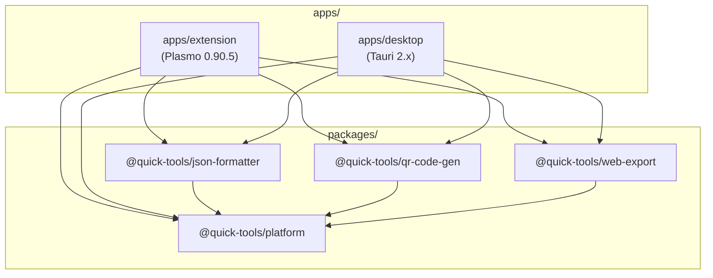

# Design Document

## Overview

This design describes the refactoring of the Quick Tools browser extension from a single Plasmo project into a pnpm monorepo. The monorepo separates platform-agnostic business logic into shared packages and supports two product forms: a Chrome extension (Plasmo) and a desktop application (Tauri 2.x). Each app maintains its own UI components independently, optimized for its platform constraints.

The key architectural principle is **dependency inversion**: core packages define interfaces for platform capabilities, and each app provides concrete implementations. This ensures core logic remains testable and portable without importing platform-specific APIs.

### Goals

- Extract three feature modules (json-formatter, qr-code-gen, web-export) into independent, platform-agnostic packages
- Define a platform adapter layer with typed interfaces for file I/O, clipboard, storage, HTTP, and content extraction
- Maintain 100% backward compatibility for the existing browser extension
- Enable a Tauri 2.x desktop app consuming the same core logic
- Each app maintains its own UI components, sharing only business logic and platform interfaces
- Use Turborepo for build orchestration with proper dependency ordering and caching

### Non-Goals

- Migrating away from React 18 or Tailwind CSS
- Adding new user-facing features during the refactoring
- Publishing packages to npm (workspace-only consumption)
- Supporting mobile platforms

## Architecture



### Dependency Flow

1. **Core packages** (`json-formatter`, `qr-code-gen`, `web-export`) depend only on `@quick-tools/platform` for platform capability interfaces
2. **App packages** depend on all shared packages and provide platform implementations; each app maintains its own UI components
3. No circular dependencies are permitted between packages

### Directory Structure

```
quick-tools/
├── pnpm-workspace.yaml
├── package.json              # root (private: true)
├── turbo.json
├── tsconfig.base.json
├── .prettierrc
├── .eslintrc.base.js
├── packages/
│   ├── json-formatter/       # @quick-tools/json-formatter
│   │   ├── package.json
│   │   ├── tsconfig.json
│   │   ├── tsup.config.ts
│   │   └── src/
│   │       ├── index.ts      # barrel export
│   │       ├── parse.ts      # JS object literal → JSON conversion
│   │       ├── format.ts     # formatting & minification
│   │       └── types.ts
│   ├── qr-code-gen/          # @quick-tools/qr-code-gen
│   │   ├── package.json
│   │   ├── tsconfig.json
│   │   ├── tsup.config.ts
│   │   └── src/
│   │       ├── index.ts
│   │       ├── history.ts    # merge, import/export logic
│   │       ├── validation.ts # history item validation
│   │       └── types.ts
│   ├── web-export/           # @quick-tools/web-export
│   │   ├── package.json
│   │   ├── tsconfig.json
│   │   ├── tsup.config.ts
│   │   └── src/
│   │       ├── index.ts
│   │       ├── markdown.ts   # markdown document generation
│   │       ├── filename.ts   # filename building & sanitization
│   │       ├── pdf.ts        # PDF page composition
│   │       ├── png.ts        # PNG export logic
│   │       ├── pagination.ts # page splitting
│   │       └── types.ts
│   └── platform/             # @quick-tools/platform
│       ├── package.json
│       ├── tsconfig.json
│       ├── tsup.config.ts
│       └── src/
│           ├── index.ts      # barrel export
│           ├── interfaces.ts # capability interfaces
│           ├── registry.ts   # registerPlatform / getPlatform
│           ├── errors.ts     # typed error results
│           └── types.ts
└── apps/
    ├── extension/            # Plasmo browser extension
    │   ├── package.json
    │   ├── tsconfig.json
    │   ├── tailwind.config.js  # plasmo- prefix
    │   ├── src/
    │   │   ├── popup.tsx
    │   │   ├── background.ts
    │   │   ├── components/   # Extension-specific UI components
    │   │   ├── platform/     # Chrome platform adapter
    │   │   │   ├── index.ts
    │   │   │   ├── storage.ts
    │   │   │   ├── downloads.ts
    │   │   │   ├── clipboard.ts
    │   │   │   ├── http.ts
    │   │   │   └── content-extractor.ts
    │   │   └── ...
    │   └── ...
    └── desktop/              # Tauri desktop app
        ├── package.json
        ├── tsconfig.json
        ├── tailwind.config.js  # no prefix
        ├── src-tauri/        # Rust backend
        │   ├── Cargo.toml
        │   ├── tauri.conf.json
        │   └── src/
        │       └── main.rs
        ├── src/
        │   ├── main.tsx
        │   ├── App.tsx
        │   ├── components/   # Desktop-specific UI components
        │   ├── platform/     # Tauri platform adapter
        │   │   ├── index.ts
        │   │   ├── storage.ts
        │   │   ├── file-system.ts
        │   │   ├── clipboard.ts
        │   │   ├── http.ts
        │   │   └── content-extractor.ts
        │   └── ...
        └── ...
```

## Components and Interfaces

### @quick-tools/platform — Platform Adapter Interfaces

```typescript
// interfaces.ts
export interface FileDownloader {
  download(data: Uint8Array | string, filename: string, mimeType: string): Promise<PlatformResult<void>>
  downloadWithDialog(data: Uint8Array | string, suggestedName: string, mimeType: string): Promise<PlatformResult<void>>
}

export interface ClipboardAccess {
  writeText(text: string): Promise<PlatformResult<void>>
  writeImage(data: Uint8Array, mimeType: string): Promise<PlatformResult<void>>
}

export interface StorageAdapter {
  get<T>(key: string): Promise<PlatformResult<T | null>>
  set<T>(key: string, value: T): Promise<PlatformResult<void>>
  remove(key: string): Promise<PlatformResult<void>>
}

export interface HttpClient {
  fetch(url: string, options?: HttpRequestOptions): Promise<PlatformResult<HttpResponse>>
}

export interface ContentExtractor {
  extractFromCurrentPage(): Promise<PlatformResult<ExtractedContent>>
  extractFromUrl(url: string): Promise<PlatformResult<ExtractedContent>>
}

export interface PlatformProvider {
  fileDownloader: FileDownloader
  clipboard: ClipboardAccess
  storage: StorageAdapter
  http: HttpClient
  contentExtractor: ContentExtractor
}
```

```typescript
// registry.ts
let currentPlatform: PlatformProvider | null = null

export function registerPlatform(provider: PlatformProvider): void {
  currentPlatform = provider
}

export function getPlatform(): PlatformProvider {
  if (!currentPlatform) {
    throw new Error("Platform not registered. Call registerPlatform() before using platform capabilities.")
  }
  return currentPlatform
}
```

```typescript
// errors.ts
export type PlatformErrorCategory =
  | "network"
  | "permission"
  | "not-found"
  | "timeout"
  | "cancelled"
  | "unknown"

export interface PlatformError {
  category: PlatformErrorCategory
  message: string
}

export type PlatformResult<T> =
  | { ok: true; value: T }
  | { ok: false; error: PlatformError }
```

### @quick-tools/json-formatter

```typescript
// parse.ts
export function parseJsonOrJsObject(text: string): unknown
// Attempts JSON.parse first, then JS object literal conversion
// Throws Error with Chinese message on failure

// format.ts
export function formatJson(value: unknown, indent?: number): string
export function minifyJson(value: unknown): string
```

### @quick-tools/qr-code-gen

```typescript
// types.ts
export interface HistoryItem {
  content: string
  timestamp: number
  tags?: string[]
}

// history.ts
export function mergeHistory(existing: HistoryItem[], imported: HistoryItem[]): HistoryItem[]
export function isValidHistoryItem(obj: unknown): obj is HistoryItem
export function exportHistoryData(history: HistoryItem[]): string  // returns JSON string
export function parseHistoryImport(jsonString: string): { items: HistoryItem[]; error?: string }
```

### @quick-tools/web-export

```typescript
// filename.ts
export function sanitizeFileName(name: string): string
export function formatTimestamp(date?: Date): string
export function buildFilenameBase(source: MarkdownExportSource): string
export function buildDownloadFilename(filenameBase: string, format: ExportFormat): string

// markdown.ts
export function buildMarkdownDocument(source: MarkdownExportSource): string

// types.ts — re-exports existing types (ExportFormat, MarkdownExportSource, RenderJob, etc.)
```

### Build Configuration

**turbo.json:**
```json
{
  "$schema": "https://turbo.build/schema.json",
  "tasks": {
    "build": {
      "dependsOn": ["^build"],
      "outputs": ["dist/**"]
    },
    "typecheck": {
      "dependsOn": ["^build"]
    },
    "lint": {},
    "dev": {
      "cache": false,
      "persistent": true
    }
  }
}
```

**tsup.config.ts (shared pattern for core packages):**
```typescript
import { defineConfig } from "tsup"

export default defineConfig({
  entry: ["src/index.ts"],
  format: ["esm", "cjs"],
  dts: true,
  clean: true,
  sourcemap: true
})
```

## Data Models

### Platform Result Type

All platform operations return `PlatformResult<T>` — a discriminated union that avoids untyped exceptions:

```typescript
type PlatformResult<T> =
  | { ok: true; value: T }
  | { ok: false; error: PlatformError }
```

### HTTP Types

```typescript
interface HttpRequestOptions {
  method?: "GET" | "POST" | "PUT" | "DELETE"
  headers?: Record<string, string>
  body?: string | Uint8Array
  timeoutMs?: number
}

interface HttpResponse {
  status: number
  headers: Record<string, string>
  body: string
  bodyBytes?: Uint8Array
}
```

### Extracted Content

```typescript
interface ExtractedContent {
  title: string
  url: string
  byline?: string
  excerpt?: string
  capturedAt: string
  markdown: string
  plainText: string
}
```

This is identical to the existing `MarkdownExportSource` type, re-exported from `@quick-tools/platform` as the canonical cross-platform type.

## Correctness Properties

*A property is a characteristic or behavior that should hold true across all valid executions of a system — essentially, a formal statement about what the system should do. Properties serve as the bridge between human-readable specifications and machine-verifiable correctness guarantees.*

### Property 1: JSON parse round-trip

*For any* valid JSON value (object, array, string, number, boolean, null), formatting it with `formatJson` and then parsing the result with `parseJsonOrJsObject` SHALL produce a value deeply equal to the original.

**Validates: Requirements 2.1, 2.6**

### Property 2: Filename sanitization removes all forbidden characters

*For any* input string, `sanitizeFileName` SHALL produce a result that contains none of the forbidden characters (`< > : " / \ | ? *` or control characters U+0000–U+001F), has length ≤ 120, and contains no consecutive whitespace.

**Validates: Requirements 2.3**

### Property 3: History merge preserves uniqueness and ordering

*For any* two lists of `HistoryItem` objects, `mergeHistory(existing, imported)` SHALL produce a result where: (a) no two items share the same `content` value, (b) items are sorted by `timestamp` in descending order, and (c) the result length is at most 50.

**Validates: Requirements 2.2**

### Property 4: History serialization round-trip

*For any* list of valid `HistoryItem` objects, serializing with `exportHistoryData` and then parsing with `parseHistoryImport` SHALL produce a list containing items with identical `content`, `timestamp`, and `tags` values as the original (order preserved).

**Validates: Requirements 2.2, 2.6**

### Property 5: Markdown document structure invariants

*For any* `MarkdownExportSource` with a non-empty title and url, `buildMarkdownDocument` SHALL produce a string that: (a) starts with `# ` followed by the title, (b) contains `- Source: ` followed by the url, (c) contains `- Captured At: ` followed by the capturedAt value, and (d) ends with a newline.

**Validates: Requirements 2.3, 2.6**

### Property 6: Platform registry round-trip

*For any* object implementing the `PlatformProvider` interface, calling `registerPlatform(provider)` followed by `getPlatform()` SHALL return the exact same object reference. Additionally, calling `getPlatform()` before any registration SHALL throw an error.

**Validates: Requirements 6.7**

### Property 7: Platform error results are well-typed

*For any* platform operation that fails, the returned `PlatformResult` SHALL have `ok: false` with an `error` object containing a `category` field matching one of the defined `PlatformErrorCategory` values and a non-empty `message` string.

**Validates: Requirements 6.6**

## Error Handling

### Strategy

All platform operations use the `PlatformResult<T>` discriminated union pattern instead of throwing exceptions. This allows core packages to handle errors without platform-specific catch logic.

### Error Categories

| Category | Description | Example |
|----------|-------------|---------|
| `network` | Network connectivity or DNS failure | HTTP request timeout |
| `permission` | Insufficient permissions | Storage access denied |
| `not-found` | Requested resource doesn't exist | Storage key missing |
| `timeout` | Operation exceeded time limit | 30s HTTP timeout in desktop |
| `cancelled` | User cancelled the operation | File save dialog dismissed |
| `unknown` | Unclassified error | Unexpected runtime error |

### Error Flow

1. **Platform adapter** catches platform-specific exceptions (Chrome API errors, Tauri errors) and wraps them in `PlatformResult`
2. **Core packages** check `result.ok` and propagate errors or handle them with fallback logic
3. **App layer** receives errors from core packages and displays user-facing messages (in Chinese per existing convention)

### Existing Error Messages Preserved

All Chinese error messages from the current codebase are preserved in the extracted packages:
- `"无法解析为JSON或JS对象: {detail}"` — json-formatter parse failure
- `"文件格式不正确，应为 JSON 数组"` — qr-code-gen import validation
- `"文件中没有找到有效的地址记录"` — qr-code-gen empty import
- `"文件内容不是有效的 JSON 格式"` — qr-code-gen JSON parse failure
- `"读取文件失败"` — qr-code-gen file read error
- `"当前页面没有可导出的正文内容。"` — web-export no content
- `"当前页面属于浏览器受限页面…"` — web-export restricted page
- `"当前页面正文提取失败。请在普通网页中重试。"` — web-export general failure
- `"未找到可导出的活动标签页。"` — web-export no active tab

## Testing Strategy

### Dual Testing Approach

This feature uses both unit tests and property-based tests for comprehensive coverage:

**Property-Based Tests** (using `fast-check` — already in devDependencies):
- Minimum 100 iterations per property
- Target pure functions in core packages: JSON parsing/formatting, filename sanitization, history merge, markdown generation, platform registry
- Each test tagged with: `Feature: monorepo-refactor, Property {N}: {description}`
- Run via `vitest` (already in devDependencies)

**Unit Tests** (example-based):
- Specific edge cases: empty strings, maximum-length filenames, history at capacity (50 items)
- Integration points: platform adapter registration, Chrome/Tauri adapter implementations
- Behavioral equivalence: known input/output pairs from current implementation

### Test Organization

```
packages/
  json-formatter/
    src/__tests__/
      parse.test.ts          # Property 1 + edge cases
      format.test.ts         # formatting examples
  qr-code-gen/
    src/__tests__/
      history.test.ts        # Properties 3, 4 + edge cases
      validation.test.ts     # isValidHistoryItem examples
  web-export/
    src/__tests__/
      filename.test.ts       # Property 2 + edge cases
      markdown.test.ts       # Property 5 + edge cases
  platform/
    src/__tests__/
      registry.test.ts       # Property 6
      errors.test.ts         # Property 7
```

### What Is NOT Property-Tested

- UI component rendering (use snapshot tests or manual verification)
- Build system configuration (smoke tests — verify files exist)
- Chrome extension manifest output (integration test — build and compare)
- Tauri window configuration (smoke test)
- Message-passing contracts (example-based integration tests)

### CI Integration

Root-level `test` script runs all package tests via `pnpm -r test`. Turborepo caches test results so unchanged packages skip re-testing.

### Package Metadata

Each package's `package.json` follows this structure:

```json
{
  "name": "@quick-tools/json-formatter",
  "version": "0.1.0",
  "type": "module",
  "exports": {
    ".": {
      "import": "./dist/index.mjs",
      "require": "./dist/index.cjs",
      "types": "./dist/index.d.ts"
    }
  },
  "files": ["dist"],
  "scripts": {
    "build": "tsup",
    "typecheck": "tsc --noEmit",
    "lint": "eslint src/"
  },
  "dependencies": {
    "@quick-tools/platform": "workspace:*"
  }
}
```

### Workspace Configuration

**pnpm-workspace.yaml:**
```yaml
packages:
  - "packages/*"
  - "apps/*"
```

### Tauri Desktop Configuration

```json
{
  "productName": "Quick Tools",
  "version": "0.1.0",
  "identifier": "com.quick-tools.desktop",
  "build": {
    "frontendDist": "../dist"
  },
  "app": {
    "windows": [
      {
        "title": "Quick Tools",
        "width": 1024,
        "height": 768,
        "minWidth": 800,
        "minHeight": 600
      }
    ]
  },
  "bundle": {
    "active": true,
    "targets": "all"
  }
}
```

