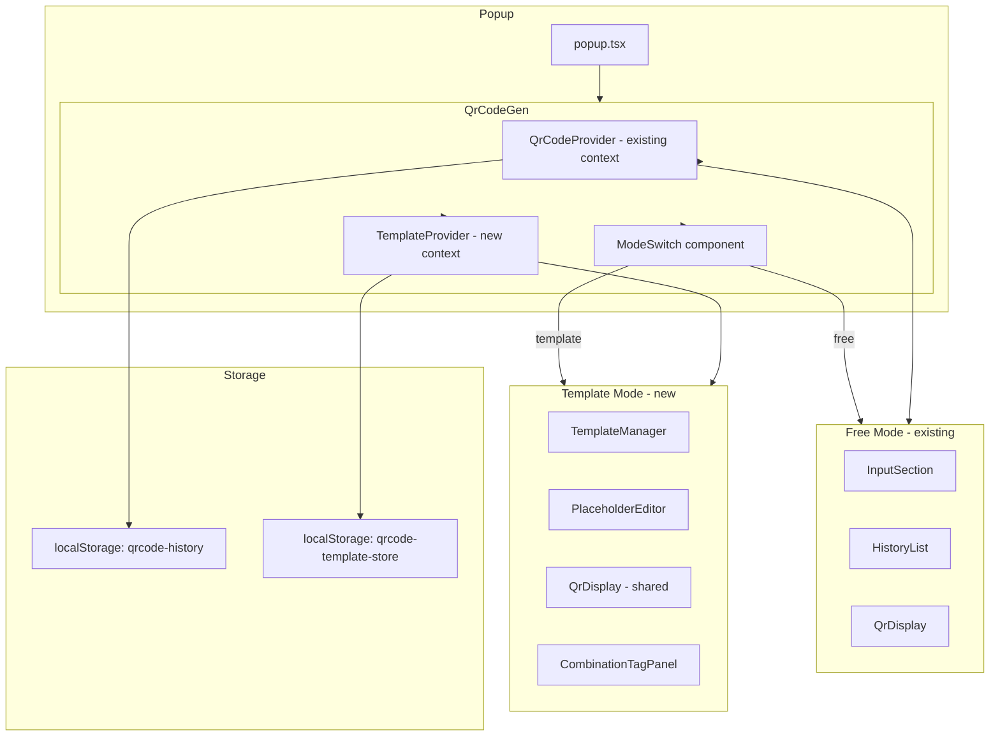
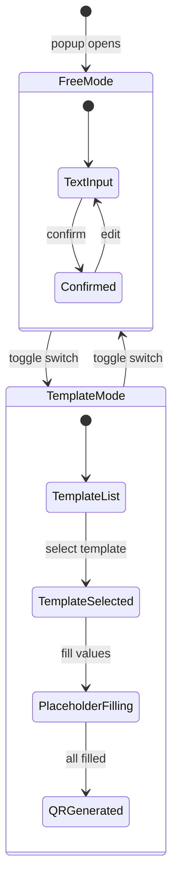

# Design Document: QR Template Generator

## Overview

本设计描述如何在现有 Popup 二维码功能中集成"模板模式"。模板模式作为 **模式切换** 嵌入现有 UI，而非独立页面或标签页。用户通过 InputSection 区域的开关在 Free_Mode（原有自由文本输入）和 Template_Mode（模板选择 + 占位符编辑）之间切换。

核心设计原则：
- **最小侵入**：不修改现有 `QrCodeProvider` 和 `qrcode-history` 数据流，模板功能使用独立的 React Context 和 localStorage 键
- **纯函数核心**：Template_Parser、Template_Pretty_Printer、Template_Renderer 均为无副作用的纯函数，便于测试和复用
- **单一数据源**：所有模板相关状态由 `TemplateProvider` 统一管理，通过单次 `localStorage.setItem` 原子写入

## Architecture

### High-Level Integration



### Mode Switch Flow



### File Structure

```
src/features/qr-code-gen/
├── index.tsx                    # Modified: wraps with TemplateProvider, adds ModeSwitch
├── context.tsx                  # UNCHANGED
├── types.ts                     # UNCHANGED
├── utils.ts                     # UNCHANGED
├── components/
│   ├── index.tsx                # Modified: re-exports new components
│   ├── InputSection.tsx         # UNCHANGED
│   ├── HistoryList.tsx          # UNCHANGED
│   ├── QrDisplay.tsx            # UNCHANGED
│   └── ModeSwitch.tsx           # NEW: toggle control
└── template/
    ├── types.ts                 # Template data models
    ├── context.tsx              # TemplateProvider + useTemplate hook
    ├── parser.ts                # Template_Parser + Template_Pretty_Printer
    ├── renderer.ts              # Template_Renderer
    ├── storage.ts               # Template_Store read/write/backup
    ├── import-export.ts         # Import_Export_Service
    └── components/
        ├── index.tsx            # Re-exports
        ├── TemplateManager.tsx  # Template CRUD UI
        ├── PlaceholderEditor.tsx # Placeholder value selection
        ├── CombinationTagPanel.tsx # Tag save/recall UI
        └── TemplateQrDisplay.tsx # QR display for template mode
```

## Components and Interfaces

### ModeSwitch

位于 `QrCodeGen` 顶层，控制 Free_Mode 和 Template_Mode 的切换。

```typescript
// src/features/qr-code-gen/components/ModeSwitch.tsx
interface ModeSwitchProps {
  mode: "free" | "template"
  onModeChange: (mode: "free" | "template") => void
}
```

- 渲染为一个 segmented control（两段式按钮），放置在 InputSection 上方
- 状态仅存于 `QrCodeGen` 组件的 `useState` 中，不持久化
- 切换时不销毁对方组件树（使用 CSS `display: none` 隐藏），以保留 Free_Mode 的输入状态

### QrCodeGen (Modified)

```typescript
// src/features/qr-code-gen/index.tsx - modified
function QrCodeGenContent() {
  const [mode, setMode] = useState<"free" | "template">("free")

  return (
    <div className="...">
      <ModeSwitch mode={mode} onModeChange={setMode} />
      <div style={{ display: mode === "free" ? "contents" : "none" }}>
        {/* existing Free Mode UI */}
      </div>
      <div style={{ display: mode === "template" ? "contents" : "none" }}>
        {/* Template Mode UI */}
      </div>
    </div>
  )
}
```

### TemplateProvider

独立的 React Context，不依赖 `QrCodeProvider`。

```typescript
// src/features/qr-code-gen/template/context.tsx
interface TemplateContextType {
  // Store state
  store: TemplateStore
  // Template CRUD
  createTemplate: (name: string, templateString: string) => Result<Template>
  updateTemplate: (id: string, patch: Partial<Pick<Template, "name" | "templateString">>) => Result<Template>
  deleteTemplate: (id: string) => void
  // Active template
  activeTemplateId: string | null
  setActiveTemplateId: (id: string | null) => void
  // Placeholder values
  addPlaceholderValue: (templateId: string, name: string, value: string) => Result<void>
  deletePlaceholderValue: (templateId: string, name: string, value: string) => void
  reorderPlaceholderValues: (templateId: string, name: string, values: string[]) => void
  // Selections (transient, not persisted)
  selections: Record<string, string>
  setSelection: (placeholderName: string, value: string) => void
  clearSelections: () => void
  // Combination tags
  saveCombinationTag: (templateId: string, name: string) => Result<void>
  deleteCombinationTag: (templateId: string, name: string) => void
  recallCombinationTag: (templateId: string, name: string) => RecallResult
  // Import/Export
  exportAll: () => void
  importFromFile: (file: File) => Promise<ImportResult>
}
```

### Template_Parser

纯函数模块，无副作用。

```typescript
// src/features/qr-code-gen/template/parser.ts
interface Segment {
  type: "literal" | "placeholder"
  value: string // literal text or placeholder name
}

interface ParseError {
  offset: number // 1-based character offset
  message: string
}

interface ParseResult {
  segments: Segment[]
  placeholderNames: string[] // deduplicated, first-occurrence order
  errors: ParseError[]
}

function parse(templateString: string): ParseResult
function print(segments: Segment[]): string
function render(templateString: string, values: Record<string, string>): string
```

### Import_Export_Service

```typescript
// src/features/qr-code-gen/template/import-export.ts
interface ExportSchema {
  version: number
  templates: Template[]
  placeholderValues: PlaceholderValueEntry[]
  combinationTags: CombinationTag[]
}

interface ImportResult {
  success: boolean
  added: { templates: number; values: number; tags: number }
  error?: string
}

function exportToFile(store: TemplateStore): void
function importFromJson(json: string, currentStore: TemplateStore): ImportResult & { mergedStore?: TemplateStore }
function validateExportSchema(data: unknown): data is ExportSchema
function mergeStores(local: TemplateStore, imported: ExportSchema): TemplateStore
```

## Data Models

### Template

```typescript
interface Template {
  id: string              // crypto.randomUUID()
  name: string            // user-editable, unique within store
  templateString: string  // contains {placeholder} tokens
  createdAt: number       // Date.now() at creation
  updatedAt: number       // Date.now() at last modification
}
```

### PlaceholderValueEntry

```typescript
interface PlaceholderValueEntry {
  templateId: string
  placeholderName: string
  values: string[]        // ordered, distinct
}
```

### CombinationTag

```typescript
interface CombinationTag {
  templateId: string
  name: string            // unique per templateId
  mapping: Record<string, string>  // placeholderName → value
  createdAt: number
}
```

### TemplateStore (localStorage schema)

```typescript
interface TemplateStore {
  templates: Template[]
  placeholderValues: PlaceholderValueEntry[]
  combinationTags: CombinationTag[]
}
```

localStorage key: `qrcode-template-store`

序列化格式：`JSON.stringify(store)`

### Result Type

```typescript
type Result<T> =
  | { ok: true; value: T }
  | { ok: false; error: string }

interface RecallResult {
  ok: boolean
  warnings: string[]  // e.g. "组合标签包含已失效的占位符"
}
```

### Export Schema

```typescript
interface ExportSchema {
  version: 1
  templates: Template[]
  placeholderValues: PlaceholderValueEntry[]
  combinationTags: CombinationTag[]
}
```

当前 schema version 为 `1`。导入时若 `version > 1` 则拒绝。

## Correctness Properties

*A property is a characteristic or behavior that should hold true across all valid executions of a system — essentially, a formal statement about what the system should do. Properties serve as the bridge between human-readable specifications and machine-verifiable correctness guarantees.*

### Property 1: Parser and Pretty Printer Round-Trip (print → parse)

*For any* well-formed segment list `S` (any sequence of literal fragments and Placeholder_Tokens whose names match `[A-Za-z0-9_-]+`), parsing the printed form SHALL reproduce `S` exactly.

```
parse(print(S)).segments ≡ S
```

**Validates: Requirements 4.12, 4.4, 4.5**

### Property 2: Template_String Round-Trip (parse → print)

*For any* Template_String `T` that the Template_Parser accepts without error, printing the parsed segment list SHALL reproduce `T` exactly.

```
print(parse(T).segments) ≡ T
```

**Validates: Requirements 4.1, 4.2, 4.12**

### Property 3: Substitution Fidelity

*For any* Template_String `T` accepted by the Template_Parser and *for any* value map `m` that supplies a value for each Placeholder in `T`, the Final_String SHALL equal the concatenation of the parsed segment list with each Placeholder_Token replaced by `m[name]` and each literal segment kept as-is.

```
render(T, m) ≡ concat(segments.map(s => s.type === "literal" ? s.value : m[s.value]))
```

**Validates: Requirements 7.1, 10.2**

### Property 4: Substitution Idempotence on Placeholder-Free Templates

*For any* Template_String `T` whose parsed segment list contains zero Placeholder_Tokens and *for any* value map `m`, applying the Template_Renderer SHALL yield the same result as decoding escaped braces in `T`.

```
render(T, m) ≡ unescape(T)   when parse(T).placeholderNames.length === 0
```

**Validates: Requirements 7.2**

### Property 5: Import and Export Round-Trip

*For any* TemplateStore snapshot `S` that satisfies the store invariants (unique Template IDs, unique Template names, distinct values per Placeholder, unique `(templateId, name)` pairs for tags), exporting `S` to JSON and importing the JSON into an empty store SHALL produce a snapshot equal to `S`.

```
import(export(S), emptyStore) ≡ S
```

**Validates: Requirements 9.1, 9.2, 9.3, 9.4, 9.5, 9.6**

### Property 6: Merge Idempotence on Repeat Import

*For any* TemplateStore snapshot `S` and *for any* valid export JSON `J`, importing `J` twice SHALL yield the same store as importing `J` once.

```
merge(merge(S, J), J) ≡ merge(S, J)
```

**Validates: Requirements 9.4, 9.5, 9.6**

### Property 7: Combination_Tag Recall Fidelity

*For any* Combination_Tag `t` saved against a Template with Template_String `T` and value map `m`, recalling `t` and re-rendering SHALL produce a Final_String equal to the Final_String at save time, provided `T` has not been mutated between save and recall.

```
render(T, recall(t).mapping) ≡ render(T, m)
```

**Validates: Requirements 8.1, 8.2**

### Property 8: Placeholder_Value Set Operations

*For any* Placeholder_Value list `L` and *for any* value `v`:

- `add(L, v)` preserves length when `v ∈ L` (deduplication)
- `add(add(L, v), v) ≡ add(L, v)` (idempotence)
- `delete(L, v) ≡ L` when `v ∉ L` (no-op on absent)
- `add(delete(L, v), v)` appends `v` at end (re-add goes to tail)

**Validates: Requirements 6.1, 6.2, 6.3, 6.5, 6.6**

### Property 9: Data Isolation

*For any* sequence of Template_Store operations, the value at localStorage key `qrcode-history` after the sequence SHALL equal the value before the sequence.

Symmetrically, *for any* sequence of Popup_QR_Feature operations, the value at localStorage key `qrcode-template-store` after the sequence SHALL equal the value before the sequence.

**Validates: Requirements 2.1, 2.2, 2.3, 2.4**

## Error Handling

### Template_Parser Errors

| Condition | Error Message | Behavior |
|-----------|--------------|----------|
| `{}` in template string | "占位符名称不能为空" | Continue scanning, include in error list |
| `{` not closed | "未闭合的占位符" (with 1-based offset) | Continue scanning, include in error list |
| `{` followed by invalid chars | "占位符名称仅允许字母、数字、下划线和连字符" | Continue scanning, include in error list |

Parser always returns partial results + all errors (never throws).

### Template CRUD Validation

| Condition | Error Message |
|-----------|--------------|
| Empty/whitespace name | "模板名称不能为空" |
| Empty/whitespace template string | "模板内容不能为空" |
| Duplicate name (case-sensitive) | "模板名称已存在" |
| Parser errors in template string | Forward parser error messages |

### Placeholder_Value Validation

| Condition | Error Message |
|-----------|--------------|
| Empty/whitespace value | "候选值不能为空" |
| Duplicate value | Silent no-op (indicate success) |

### Combination_Tag Validation

| Condition | Error Message |
|-----------|--------------|
| Incomplete placeholder selections | "请先为所有占位符选择候选值" |
| Duplicate tag name | Confirmation dialog: "组合标签名称已存在，是否覆盖？" |
| Stale placeholder on recall | Warning: "组合标签包含已失效的占位符" (partial recall) |
| Missing candidate value on recall | Re-add value to candidate list silently |

### Import/Export Errors

| Condition | Error Message |
|-----------|--------------|
| Invalid JSON | "文件内容不是有效的 JSON 格式" |
| Wrong schema shape | "文件格式不正确" |
| Version too new | "文件版本过新，请升级扩展后再导入" |

### Storage Recovery

When `qrcode-template-store` contains unparseable JSON on initialization:
1. Log error to `console.error`
2. Copy raw string to `qrcode-template-store.bak`
3. Initialize in-memory store as empty
4. Overwrite `qrcode-template-store` with empty store JSON on first write

### QR Code Length Warning

When `Final_String.length > 2953`:
- Display warning: "内容过长，二维码可能无法被识别"
- Still attempt to render the QR code

## Testing Strategy

### Property-Based Tests

Library: **fast-check** (TypeScript property-based testing library)

Each property test runs a minimum of **100 iterations** with randomized inputs.

| Property | Module Under Test | Generator Strategy |
|----------|-------------------|-------------------|
| Property 1: print→parse round-trip | `parser.ts` | Random segment lists with arbitrary Unicode literals and valid placeholder names |
| Property 2: parse→print round-trip | `parser.ts` | Random valid template strings mixing literals, `{{`/`}}` escapes, and `{name}` tokens |
| Property 3: Substitution fidelity | `renderer.ts` | Random valid template strings + complete value maps |
| Property 4: Placeholder-free idempotence | `renderer.ts` | Random template strings with no `{name}` tokens (only literals and escapes) |
| Property 5: Import/export round-trip | `import-export.ts` | Random valid TemplateStore snapshots |
| Property 6: Merge idempotence | `import-export.ts` | Random stores + random export JSONs |
| Property 7: Recall fidelity | `context.tsx` (logic) | Random templates + complete value maps saved as tags |
| Property 8: Value set operations | `storage.ts` (logic) | Random string lists + random values |
| Property 9: Data isolation | `storage.ts` + `context.tsx` | Random operation sequences on both stores |

Tag format for each test: `Feature: qr-template-generator, Property {N}: {title}`

### Unit Tests (Example-Based)

- Mode switch defaults to Free_Mode on mount
- Mode switch preserves Free_Mode state across toggles
- Template creation with valid inputs produces correct fields
- Template deletion cascades to placeholder values and combination tags
- Parser handles `{}`, unclosed `{`, invalid characters (specific error messages)
- Combination_Tag recall with stale placeholders shows warning
- QR length warning at 2954 characters
- Import rejects version > 1

### Integration Tests

- Full flow: create template → add placeholder values → select values → QR renders
- Import file → verify merged store state
- localStorage corruption recovery (backup + empty init)
- Free_Mode operations don't touch `qrcode-template-store`
